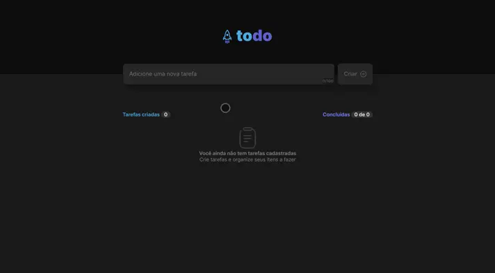

# Rocketseat Challenge 01: To-do List



> 🌐 [https://todo.gargani.dev/](https://todo.gargani.dev/)


   

## Descrição / Description

Lista de afazeres desenvolvida com `React` (`Vite`) + `TypeScript` ([Saiba como](https://vitejs.dev/guide/)) para um dos desafios da `Rocketseat`, em setembro de 2023.

To-do list developed with `React` (`Vite`) + `TypeScript` ([Learn how](https://vitejs.dev/guide/)) for one of the `Rocketseat` challenges, in September 2023.

> ⭐ O projeto é publicado através do [GitHub Pages](https://docs.github.com/pt/pages/getting-started-with-github-pages/about-github-pages). O `CI/CD` é feito com o apoio do [GitHub Actions](https://docs.github.com/pt/actions/learn-github-actions/understanding-github-actions).
>
> ⭐ The project is published through [GitHub Pages](https://docs.github.com/en/pages/getting-started-with-github-pages/about-github-pages). `CI/CD` is powered by [GitHub Actions](https://docs.github.com/en/actions/learn-github-actions/understanding-github-actions).

## Como rodar / How to run

> ⚠️ Necessita de um [navegador web](https://www.mozilla.org/pt-BR/firefox/download/thanks/) e do [NodeJS](https://nodejs.org/pt-br/). O projeto foi testado utilizando a versão `18.17.1`.

> ⚠️ Requires a [web browser](https://www.mozilla.org/pt-BR/firefox/download/thanks/) and [NodeJS](https://nodejs.org/en/). The project was tested using version `18.17.1`.

```bash
npm i # Install the packages / Instale os pacotes
```

```bash
npm run dev # Run the `dev` script / Rode o script `dev`
```

Após a compilação ocorrer, use o navegador para acessar o endereço `http://localhost:5173/`.

After compilation takes place, use the browser to access the address `http://localhost:5173/`.

## Rodar com o Docker / Run with Docker

> ⚠️ Necessita do [Docker](https://docs.docker.com/engine/install/) instalado no host para funcionar.

> ⚠️ Requires [Docker](https://docs.docker.com/engine/install/) installed on the host to work.

```bash
docker run -it --rm -v $(pwd):/app -p 5173:5173 node:18.17.1-alpine sh -c "npm --prefix=/app i && npm --prefix=/app run dev -- --host"
```

Após a compilação ocorrer, use o navegador para acessar o endereço `http://localhost:5173/`.

After compilation takes place, use the browser to access the address `http://localhost:5173/`.

## Rodar a build com `nginx` (`Docker-compose`) / Run the build with `nginx` (`Docker-compose`)

### Como rodar / How to run

> ⚠️ Necessita de um [navegador web](https://www.mozilla.org/pt-BR/firefox/download/thanks/) e do [Docker](https://docs.docker.com/engine/install/) instalado no host para funcionar.

> ⚠️ Requires a [web browser](https://www.mozilla.org/pt-BR/firefox/download/thanks/) and [Docker](https://docs.docker.com/engine/install/) installed on the host to work.

```bash
docker compose up -d --build
```

Após iniciar o container, use o navegador para acessar o endereço `http://localhost:8080/`.

After starting the container, use the browser to access the address `http://localhost:8080/`.

### Como parar / How to stop

```bash
docker compose down
```
